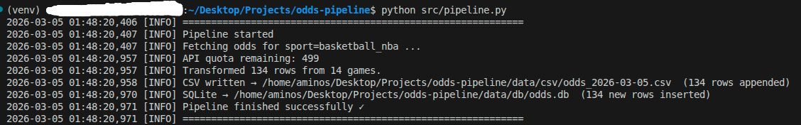
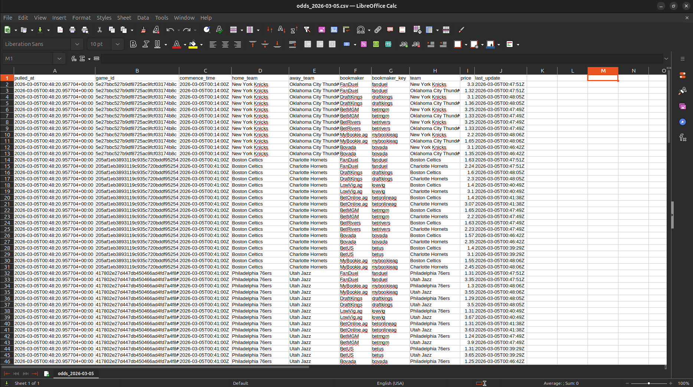

# 🏀 Sports Odds ETL Pipeline

Automated pipeline that pulls live NBA odds from [The Odds API](https://the-odds-api.com/), transforms the nested JSON into clean tabular data, and stores snapshots to both **CSV** and **SQLite** on a **cron schedule**.

Built as a portfolio demonstration of API extraction → ETL → automated storage — directly applicable to prediction market data (Kalshi, Polymarket) and any time-series odds or pricing pipeline.

---

## 📸 Screenshots

### Pipeline run output


### SQLite query results


### CSV snapshot


---

## 🏗️ Architecture

```
The Odds API
     │
     ▼
┌─────────────┐     ┌──────────────┐     ┌─────────────────────┐
│   Extract   │────▶│  Transform   │────▶│        Load         │
│  fetch_odds │     │  flatten +   │     │  CSV  +  SQLite     │
│  (requests) │     │  normalize   │     │  deduplicated rows  │
└─────────────┘     └──────────────┘     └─────────────────────┘
                                                   │
                                        ┌──────────┘
                                        ▼
                               cron job (every 15 min)
                               logs/pipeline.log
```

**Data flow:**
- **Extract** — single `GET /sports/{sport}/odds` call, handles HTTP errors and logs remaining API quota
- **Transform** — flattens bookmaker → market → outcome nesting into flat rows; attaches `pulled_at` UTC timestamp to every row
- **Load CSV** — appends to a daily file (`odds_YYYY-MM-DD.csv`); creates header on first write
- **Load SQLite** — inserts with `UNIQUE` constraint on `(game_id, bookmaker_key, team, pulled_at)` to prevent duplicates across reruns

---

## 📁 Project Structure

```
odds-pipeline/
├── src/
│   ├── pipeline.py      # ETL orchestrator
│   └── query.py         # Inspection / reporting helper
├── data/
│   ├── csv/             # Daily CSV snapshots (odds_YYYY-MM-DD.csv)
│   └── db/              # SQLite database (odds.db)
├── logs/
│   └── pipeline.log     # Rotating run logs
├── requirements.txt
└── README.md
```

---

## ⚙️ Setup

### 1. Clone & install
```bash
git clone https://github.com/YOUR_USERNAME/odds-pipeline.git
cd odds-pipeline
pip install -r requirements.txt
```

### 2. Get a free API key
Sign up at [the-odds-api.com](https://the-odds-api.com/) — free tier gives 500 requests/month, enough for ~1 snapshot every 2 hours.

### 3. Set your API key
```bash
export ODDS_API_KEY=your_key_here
```

Or create a `.env` file and load it in your shell profile.

### 4. Run manually
```bash
python src/pipeline.py
```

### 5. Inspect collected data
```bash
python src/query.py
```

---

## 🕐 Cron Automation

Run every 15 minutes and log output:

```bash
crontab -e
```

Add this line:
```cron
*/15 * * * * cd /path/to/odds-pipeline && ODDS_API_KEY=your_key python src/pipeline.py >> logs/cron.log 2>&1
```

Verify it's registered:
```bash
crontab -l
```

---

## 🗄️ Output Schema

### CSV columns / SQLite `odds` table

| Column | Type | Description |
|---|---|---|
| `pulled_at` | TEXT (ISO 8601 UTC) | When the snapshot was taken |
| `game_id` | TEXT | Unique game identifier from the API |
| `commence_time` | TEXT | Scheduled tip-off time (UTC) |
| `home_team` | TEXT | Home team name |
| `away_team` | TEXT | Away team name |
| `bookmaker` | TEXT | Bookmaker display name |
| `bookmaker_key` | TEXT | Bookmaker slug (e.g. `draftkings`) |
| `team` | TEXT | Team this price applies to |
| `price` | REAL | American odds (e.g. `-110`, `+240`) |
| `last_update` | TEXT | Bookmaker's last odds update time |

---

## 🔌 Extending This Pipeline

This pattern applies directly to other data sources:

- **Kalshi** — swap `fetch_odds()` to call `/markets/{ticker}/trades`; same transform + load logic applies
- **Polymarket** — query the CLOB fills endpoint for per-trade price + timestamp
- **Any REST API** — the ETL structure (extract → normalize → CSV + DB) is source-agnostic

To add a new sport: change `SPORT = "basketball_nba"` to any sport key supported by The Odds API (e.g. `americanfootball_nfl`, `baseball_mlb`).

---

## 🛠️ Tech Stack

`Python` · `requests` · `sqlite3` · `csv` · `logging` · `cron`

---

## 📄 License

MIT